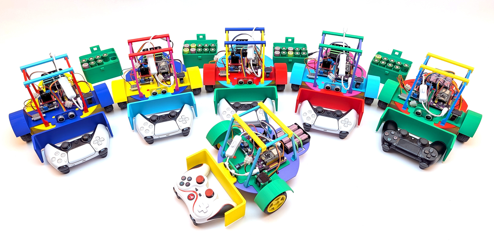

# ESP32 School Robot Car - Talente-Tour 2026

A redesigned ESP32-based robot car built for a primary-school robotics project week. PS4/PS5-controller driving, autonomous obstacle avoidance, on-device calibration via OLED menu - open hardware, open code, fully repairable. Built so 8-year-olds can understand every part of it and fix it when something breaks.

---

## About this project

In May 2026 I ran a robotics project week as part of the **Talente-Tour 2026** at a primary school near Munich. Six ESP32-powered robot cars were built and programmed by 3rd and 4th graders, who worked through wiring, motor control, and basic programming over the course of the week.

This repository contains everything needed to rebuild the project:

- 🖨️ STL files for the chassis and mechanical parts
- 🔌 A complete hardware list with vendor links
- 💻 ESP32 firmware (Arduino sketch) with PS-controller support, autonomous mode, and on-device calibration

The design philosophy: every component understandable, every part replaceable. No proprietary kits, no glue-the-screws-in. Kids should see what's inside, fix it when it breaks, and modify it when they have a new idea. That's where curiosity starts.

---

## What you'll need

### Hardware

A short overview - see [`HARDWARE.md`](HARDWARE.md) for the full bill of materials with vendor links and prices, and the complete pin-by-pin wiring map.

- 1 × ESP32 development board
- 1 × motor driver (L298N) - the **ENA/ENB pins are jumpered HIGH**, PWM is done on the IN1–IN4 lines instead
- 2 × DC gear motors with matching wheels
- 1 × 0.96″ OLED display (SSD1306, I²C, 128×64) - shows controller status, mode, distance, and the calibration menu
- 1 × HC-SR04 ultrasonic sensor - autonomous obstacle detection
- 1 × PS4 or PS5 controller - wireless driving (paired via Bluepad32)
- 1 × battery holder + batteries (or 1 × LiPo + charger)
- jumper wires, screws, USB cable

### Tools

- 3D printer (or a printing service)
- soldering iron (for the header pins, unless your board has them pre-soldered)
- USB cable + a computer with [Arduino IDE](https://www.arduino.cc/en/software) or [PlatformIO](https://platformio.org/)

### 3D-printed parts

All STL files are in [`stl/`](stl/). Recommended print settings:

| Setting       | Value          |
|---------------|----------------|
| Material      | PLA            |
| Layer height  | 0.2 mm         |
| Infill        | 20 %           |
| Supports      | only where indicated in the part-specific README |

---

## Build steps

1. **Print** the chassis and mounts from [`stl/`](stl/)
2. **Solder** header pins to the ESP32 board if needed
3. **Wire** the components according to the pin-by-pin map in [`HARDWARE.md`](HARDWARE.md). Don't forget to **jumper ENA/ENB to HIGH** on the L298N - the firmware does PWM on IN1–IN4, not on the enable pins.
4. **Flash** the firmware from [`firmware/`](firmware/) with the Arduino IDE (or PlatformIO). Required libraries: *Bluepad32*, *Adafruit SSD1306*, *Adafruit GFX*, and *Preferences* (built-in).
5. **Pair** a PS4 or PS5 controller - power on the car, then put the controller into pairing mode (Share + PS button held until the lightbar flashes rapidly). The OLED shows *Ctrl Connected* once it's paired.
6. **Drive, modify, break, repair, repeat.**

---

## Firmware - what it does

The single `.ino` sketch in [`firmware/`](firmware/) gives the car three modes:

### 🎮 Manual mode (default)
Drive the car with a PS4 or PS5 controller. The left stick controls forward/backward and steering. The OLED shows live left/right motor speeds.

### 🤖 Autonomous mode - toggle with Square
The car drives forward at ~60 % speed and uses the HC-SR04 ultrasonic sensor to watch for obstacles. When something is closer than 20 cm, it reverses for ~400 ms, turns in a random direction for ~450 ms, and continues forward. The OLED shows the live distance reading.

### 🛠️ Setup mode - toggle with Options
A menu on the OLED lets you calibrate the **left and right motor trim values** so the car drives straight. No two cheap DC motors run at exactly the same speed; the trim is a per-side multiplier (0–100 %) that scales the faster motor down until both wheels match.

Calibration is stored in **non-volatile storage (NVS)** on the ESP32 - so once a kid finds the right values for *their* car, it remembers them across reboots without ever touching the code or the computer.

### Safety
Motors stop automatically if the controller disconnects, or if no command has been received for 5 seconds.

---

## How this version compares to my other robot car

The same principles, but with a different scope. This version is paired down for a workshop setting:

- **This repo** - PS-controller + HC-SR04 obstacle avoidance + OLED setup menu. Wiring is simple enough that 3rd/4th graders can do it themselves.
- **[esp32-roboter-auto](https://github.com/custom-build-robots/esp32-roboter-auto)** - adds an MPU6050 IMU for precise turn angles and additional driving behaviors. More capable, more wiring, more complex code.

If you're running a workshop or just starting with ESP32 robotics, build the version in this repo first.

---

## License

- **Code** in [`firmware/`](firmware/) - [MIT License](LICENSE)
- **3D models** in [`stl/`](stl/) and **documentation** - [CC BY-SA 4.0](https://creativecommons.org/licenses/by-sa/4.0/)

You're warmly encouraged to use this in your classroom, makerspace, or workshop. If you do, I'd love to hear about it - drop me a line on [LinkedIn](https://linkedin.com/in/ingmar-stapel).

---

## Background

This project builds on design principles from my book ***Roboter-Autos mit dem ESP32*** (Rheinwerk Verlag), simplified for younger learners. The book covers the more advanced setup with autonomous navigation, IMU-based driving, and remote control.

---

## Credits

Built for the **Talente-Tour 2026** by [Ingmar Stapel](https://github.com/custom-build-robots).
Find more at [ai-box.eu](https://ai-box.eu) · [custom-build-robots.com](https://custom-build-robots.com) · [LinkedIn](https://linkedin.com/in/ingmar-stapel)
